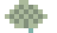
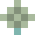
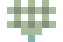
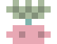

<!--
  johanna nguyen — github profile readme
  palette: soft pink / sage-mint / light blue / cream
  pixel icons live in assets/pixel-pack/svg/ — keep that folder in your repo (johannanguyen1/johannanguyen1)
  so the  tags below resolve. swap hex codes in badge urls to re-theme.
-->

<div align="center">


**providence, ri · brown university · currently @ preveil**

</div>

<p align="center">

</p>

##  about me

junior at brown studying applied math–cs, focused on systems and security. i like software that stays close to the hardware — crypto backends, embedded firmware, custom network stacks. currently at **preveil**, unifying cryptography across desktop, ios, android, and web. previously at **pratt & whitney (rtx)**, verifying jet engine control software.

<p align="center">

</p>

##  tech stack

**languages**
<br/>


**embedded / systems**
<br/>


**tools**
<br/>


**quantum / crypto**
<br/>


<p align="center">

</p>

##  featured projects

<table width="100%">
<tr>
<td width="50%" valign="top">

**reliable transport protocol** — `go` `wireshark` `docker`

user-space tcp/ip stack built from rfc 9293, 3.6x faster than the course reference implementation. full tcp state machine, socket multiplexing, retransmission timers, sliding-window flow control.

`github.com/johannanguyen1/reliable-transport-protocol` *(placeholder — link your repo)*

</td>
<td width="50%" valign="top">

**secure multi-candidate voting system** — `c++` `cryptopp` `zkp`

extended a crypto voting protocol for k-of-n ballots under public-key encryption. hmac integrity checks and a custom zkp wrapper for client-side ballot verification.

`github.com/johannanguyen1/secure-voting-system` *(placeholder — link your repo)*

</td>
</tr>
<tr>
<td width="50%" valign="top">

**quantum entanglement benchmark** — `python` `qrisp` `iqm` — 3rd place, iquhack mit

multipartite entanglement detection using witness operators and stabilizer circuits, verified across 12 qubits on real nisq hardware.

`github.com/johannanguyen1/quantum-entanglement-benchmark` *(placeholder — link your repo)*

</td>
<td width="50%" valign="top">

**fsae digital dashboard** — `c++` `teensy 4.1` `can bus`

brown formula racing's first digital dashboard, deployed on the 2025 competition car. spi driver for the mcp2515 can controller with a tiered refresh scheduler.

`github.com/johannanguyen1/fsae-digital-dashboard` *(placeholder — link your repo)*

</td>
</tr>
</table>

<p align="center">

</p>

##  experience

```
2026–present   software engineering intern, preveil
               unified 8 crypto backends into one kotlin multiplatform interface

2025 (fall)    research fellow, carettalab @ brown
               iot monitoring network (esp32 + pi) across 4 lab chillers

2025 (summer)  software verification intern, pratt & whitney (rtx)
               automated evb calibration: 8 hrs → <10 min across 135+ sensors

2023–2025      driver controls lead, brown formula racing (fsae)
               built the team's first digital dashboard for the 2025 car
```

<p align="center">

</p>

##  currently

<table width="100%">
<tr>
<td width="25%" align="center"><br/>learning<br/><sub>kotlin multiplatform architecture</sub></td>
<td width="25%" align="center"><br/>reading<br/><sub>add your current book here</sub></td>
<td width="25%" align="center"><br/>exploring<br/><sub>quantum algorithms</sub></td>
<td width="25%" align="center"><br/>goals<br/><sub>go deeper on systems + security</sub></td>
</tr>
</table>

<p align="center">

</p>

##  interests

<p align="center">


</p>

<p align="center">

</p>

##  fun facts

- wrote the onboarding handbook that let a 6-person subteam build their own can-integrated shift-light
- took 3rd at iquhack mit running algorithms on real quantum hardware, not just simulators
- turned an 8-hour manual calibration process into under 10 minutes

<p align="center">

</p>

##  github stats

<div align="center">


<br/>


</div>

<p align="center">

</p>

##  contact

<p align="center">
<a href="https://github.com/johannanguyen1"></a>
<a href="https://linkedin.com/in/johanna-b-nguyen"></a>
<a href="mailto:johanna_nguyen@brown.edu"></a>
</p>

<div align="center">


thanks for stopping by


</div>
